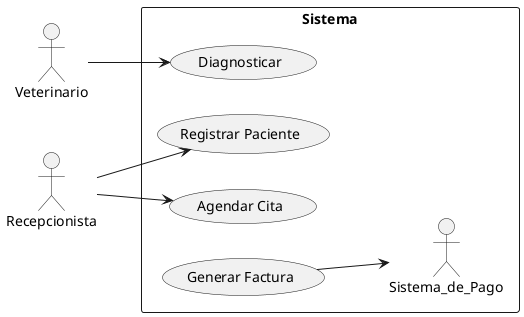

**Unidad 1**, integrando requisitos:

---

### **Unidad 1 - Modelado del Sistema (Versión Práctica & Moderna)**
**Duración:** 3 semanas  
**Objetivos:**  
1. Aprender modelado de sistemas **haciendo**, con Python y UML.  
2. Usar GitHub como herramienta central (Branches, PRs, Milestones).  
3. Aplicar principios de neurociencia para mejorar la retención (ej. espaciamiento, práctica activa).  

---

### **Estructura por Semana**  
#### **Semana 1: Introducción al Modelado con UML + GitHub Básico**  
**Actividades:**  
1. **Ejercicio Python + UML (Casos de Uso):**  
   - **Enunciado:** *"Modelar un sistema de biblioteca (Python + UML)"*.  
     - Los estudiantes escriben en Python un script básico que simule acciones como `prestar_libro()`, `devolver_libro()`.  
     - Luego, crean un **diagrama de casos de uso** (usando herramientas como [PlantUML](https://plantuml.com/) o [Mermaid](https://mermaid.js.org/) integrado en GitHub Markdown).  
   - **Solución:**  
     - Repositorio GitHub con código Python + archivo `.puml` o diagrama en README.md.  

2. **GitHub Onboarding:**  
   - Crear un repo con una estructura estándar (ej: `/docs` para UML, `/src` para código).  
   - Usar **Milestones** para organizar entregas (ej: "Semana 1 - Casos de Uso").  

**Neurociencia Aplicada:**  
- **Espaciamiento:** Enviar un quiz de 3 preguntas (vía Google Form) 24h después para reforzar memoria.  

---

#### **Semana 2: Diagramas Estructurales (Clases) + Branches/PRs**  
**Actividades:**  
1. **Ejercicio Python + Diagrama de Clases:**  
   - **Enunciado:** *"Extiende la biblioteca: modelar clases en Python y UML"*.  
     - Implementar clases en Python (`Libro`, `Usuario`, `Biblioteca`) y relacionarlas.  
     - Generar un **diagrama de clases** desde el código usando:  
       - `pyreverse` (de [Graphviz](https://graphviz.org/)) o librerías como `pylint`.  
   - **Solución:**  
     - Subir diagrama generado automáticamente en el repo (usando GitHub Actions).  

2. **GitHub Avanzado:**  
   - Trabajar con **branches**: `feature/clases`, `feature/diagramas`.  
   - Hacer **Pull Requests** y revisar código entre pares (peer review).  

**Neurociencia Aplicada:**  
- **Práctica Activa:** Parejas explican sus diagramas en 2 minutos (micro-teaching).  

---

#### **Semana 3: Diagramas de Comportamiento (Secuencia) + Automatización**  
**Actividades:**  
1. **Ejercicio Python + Diagrama de Secuencia:**  
   - **Enunciado:** *"Modelar el flujo de prestar un libro con un diagrama de secuencia"*.  
     - Usar `mermaid.js` en GitHub para dibujarlo directamente en el README.  
     - Opcional: Simular interacciones con Python (ej: logs de consola).  

2. **GitHub Actions:**  
   - Automatizar generación de diagramas al hacer push (ej: con un workflow que ejecute `pyreverse`).  

**Neurociencia Aplicada:**  
- **Retrieval Practice:** Al final de clase, escribir en un post-it 3 conceptos clave y compartirlo.  

---

### **Ejemplo Concreto Integrado**  
**Repositorio GitHub de Ejemplo:**  
- **Estructura:**  
  ```plaintext
  /src
    biblioteca.py  # Código Python con clases
  /docs
    casos_de_uso.puml  # Diagramas UML
  README.md          # Instrucciones + diagramas embebidos
  ```  
- **GitHub Actions:** Archivo `.github/workflows/diagrams.yml` para generar imágenes automáticamente.  

**Enlace a Solución:**  
Puedes crear un repo plantilla para que clonen:  
```bash
gh repo clone tu-usuario/modelado-biblioteca-template
```

---

### **Bonus: Técnicas de Neurociencia**  
1. **Aprendizaje Basado en Proyectos (PBL):** Que modelen un sistema real (ej: Spotify mini).  
2. **Gamificación:** Dar "insignias" digitales (en GitHub) por completar hitos.  
3. **Feedback Inmediato:** Usar GitHub Discussions para resolver dudas en tiempo real.  

--- 

### **Recursos Adicionales**  
- **Herramientas UML Gratuitas:** PlantUML, Draw.io (integración con GitHub).  
- **Libro Recomendado:** *"Neurociencia para Educadores"* de David Bueno.  

---

 **Ejercicio integrador** para las 3 semanas, combinando **UML, Python, GitHub, automatización y neurociencias**, con un enfoque práctico y escalable:

---

### **Ejercicio Integrador: Sistema de Gestión de una Clínica Veterinaria**  
**Objetivo:** Modelar, diseñar e implementar (parcialmente) un sistema para gestionar citas, pacientes y veterinarios, aplicando UML, Python y GitHub.  

#### **Entregables por Semana**  
| Semana | Hito (Milestone) | Diagrama UML | Código Python | GitHub Acciones |  
|--------|------------------|--------------|---------------|----------------|  
| 1 | Casos de Uso + Repo | Diagrama de Casos de Uso | - | Crear repo, milestones, issues |  
| 2 | Diagrama de Clases | Diagrama de Clases | Clases básicas (`Paciente`, `Veterinario`) | Branches, PRs, peer review |  
| 3 | Diagrama de Secuencia | Diagrama de Secuencia | Lógica de agendar citas | Automatizar diagramas con Actions |  

---

### **Enunciado Detallado**  

#### **1. Semana 1: Modelado Inicial (Casos de Uso + GitHub Setup)**  
**Tarea:**  
- **Crear un repositorio GitHub** llamado `veterinaria-software-2024` con:  
  - README.md (descripción del proyecto).  
  - Milestone "Semana 1: Casos de Uso".  
- **Diagrama de Casos de Uso** (usando PlantUML o Mermaid):  
  - Actores: `Veterinario`, `Recepcionista`, `Sistema de Pago`.  
  - Casos de Uso: `Agendar Cita`, `Registrar Paciente`, `Generar Factura`.  

**Ejemplo de código PlantUML (en `/docs/usecase.puml`):**  


**Neurociencia:**  
- **Actividad en clase:** Discutir en grupos cómo los casos de uso se relacionan con requerimientos funcionales (retrieval practice).  

---

#### **2. Semana 2: Diagrama de Clases + Implementación Básica**  
**Tarea:**  
- **Diagrama de Clases** (autogenerado desde Python con `pyreverse`):  
  - Clases: `Paciente` (atributos: `id`, `nombre`, `especie`), `Veterinario`, `Cita`.  
  - Relaciones: Agregación entre `Cita` y `Paciente`.  
- **Código Python** (en `/src/models.py`):  
```python  
class Paciente:  
    def __init__(self, id: int, nombre: str, especie: str):  
        self.id = id  
        self.nombre = nombre  
        self.especie = especie  

class Cita:  
    def __init__(self, paciente: Paciente, fecha: str):  
        self.paciente = paciente  
        self.fecha = fecha  
```  

**GitHub:**  
- Crear un branch `feature/clases`, hacer commit, y abrir un **PR** para revisión.  
- **Peer review guideline:** Verificar que el código coincida con el diagrama.  

**Neurociencia:**  
- **Micro-teaching:** En parejas, explicar una relación del diagrama (ej: herencia vs. agregación).  

---

#### **3. Semana 3: Diagrama de Comportamiento + Automatización**  
**Tarea:**  
- **Diagrama de Secuencia** (en `/docs/sequence.puml`):  
  - Modelar el flujo de `Agendar Cita`:  
    1. Recepcionista → Sistema: `verificar_disponibilidad()`.  
    2. Sistema → Base de Datos: `consultar_veterinario()`.  
- **Automatización con GitHub Actions** (en `.github/workflows/diagrams.yml`):  
```yaml  
name: Generate UML  
on: push  
jobs:  
  build:  
    runs-on: ubuntu-latest  
    steps:  
      - uses: actions/checkout@v4  
      - name: Generate PNG from PlantUML  
        uses: cloudbees/plantuml-github-action@v1  
        with:  
          files: docs/*.puml  
```  

**Neurociencia:**  
- **Cierre:** Cada estudiante escribe en un issue de GitHub un "¿Qué aprendí hoy?" (metacognición).  

---

### **Solución Esperada**  
- **Repositorio Final:**  
  - Estructura:  
    ```  
    veterinaria-software-2024/  
    ├── src/  
    │   └── models.py  
    ├── docs/  
    │   ├── usecase.puml  
    │   ├── sequence.puml  
    │   └── classes.png   # Autogenerado  
    ├── .github/workflows/  
    │   └── diagrams.yml  
    └── README.md  
    ```  
  - **Enlace de ejemplo:** [github.com/tu-usuario/veterinaria-software-2024](https://github.com/tu-usuario/veterinaria-software-2024).  

---

### **Beneficios del Ejercicio**  
- **Contexto real:** Sistema veterinario es tangible y motivador.  
- **Integra todas las herramientas:** UML + Python + GitHub + CI/CD.  
- **Refuerzo con neurociencia:** Espaciamiento, práctica activa, metacognición.  


<!--stackedit_data:
eyJoaXN0b3J5IjpbLTE4OTA0NjE4MjRdfQ==
-->