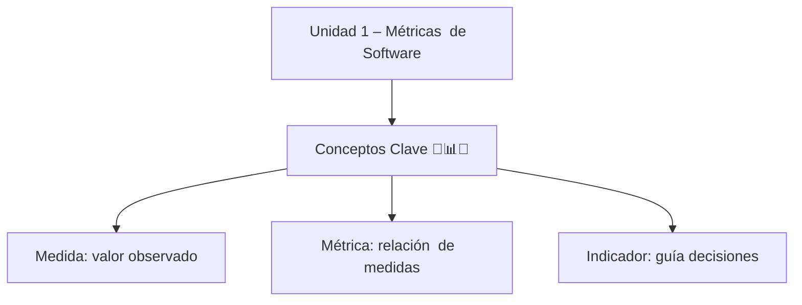

  

A  --> C[Tipos  de  Métricas 📝🔄🛠️❌⏱️]

C  --> C1[Tamaño: líneas  de  código, módulos]

C  --> C2[Complejidad: ciclomática]

C  --> C3[Calidad: densidad  de  defectos, cobertura]

C  --> C4[Interfaz  de  usuario: pasos  por  tarea, errores, tiempo]

  

A  --> D[Métricas  Técnicas  y  de  Calidad 🖥️🏆]

D  --> D1[Técnicas: acoplamiento, cohesión, tamaño  de  código]

D  --> D2[Calidad: cumplimiento  de  requerimientos, densidad  de  defectos]

  

A  --> E[Métricas  de  Mantenimiento  y  Pruebas ✍️⏳]

E  --> E1[Mantenimiento: comentarios, complejidad, tamaño]

E  --> E2[Pruebas: cobertura  de  código, defectos  encontrados, tiempo  de  resolución]

  

A  --> F[Aplicación  Práctica / Ejemplos]

F  --> F1[Integración  al  proyecto  integral: sistema  de  inventario]

F  --> F2[↑ defectos → más  pruebas  o  refactorización]

F  --> F3[↑ tiempo  de  aprendizaje → mejorar  interfaz]

  

A  --> G[Tips  de  Repaso  Rápido]

G  --> G1[Asociar  cada  métrica  con  ejemplo  práctico]

G  --> G2[Usar  tabla  resumida / infografía  como  guía  visual]

G  --> G3[Recordar  conexión  con  Ingeniería  de  Software  I]
```
<!--stackedit_data:
eyJoaXN0b3J5IjpbLTc0NzkxMzg4Ml19
-->