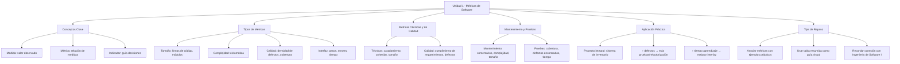

```mermaid

graph TD

U1[Unidad 1 - Métricas de Software] --> C[Conceptos Clave]

C --> C1[Medida: valor observado]

C --> C2[Métrica: relación de medidas]

C --> C3[Indicador: guía decisiones]

  

U1 --> T[Tipos de Métricas]

T --> T1[Tamaño: líneas de código, módulos]

T --> T2[Complejidad: ciclomática]

T --> T3[Calidad: densidad de defectos, cobertura]

T --> T4[Interfaz: pasos, errores, tiempo]

  

U1 --> MT[Métricas Técnicas y de Calidad]

MT --> MT1[Técnicas: acoplamiento, cohesión, tamaño]

MT --> MT2[Calidad: cumplimiento de requerimientos, defectos]

  

U1 --> MP[Mantenimiento y Pruebas]

MP --> MP1[Mantenimiento: comentarios, complejidad, tamaño]

MP --> MP2[Pruebas: cobertura, defectos encontrados, tiempo]

  

U1 --> A[Aplicación Práctica]

A --> A1[Proyecto integral: sistema de inventario]

A --> A2[↑ defectos → más pruebas/refactorización]

A --> A3[↑ tiempo aprendizaje → mejorar interfaz]

  

U1 --> R[Tips de Repaso]

R --> R1[Asociar métricas con ejemplos prácticos]

R --> R2[Usar tabla resumida como guía visual]

R --> R3[Recordar conexión con Ingeniería de Software I]

```
<!--stackedit_data:
eyJoaXN0b3J5IjpbLTE2MzUzMzk4MDhdfQ==
-->