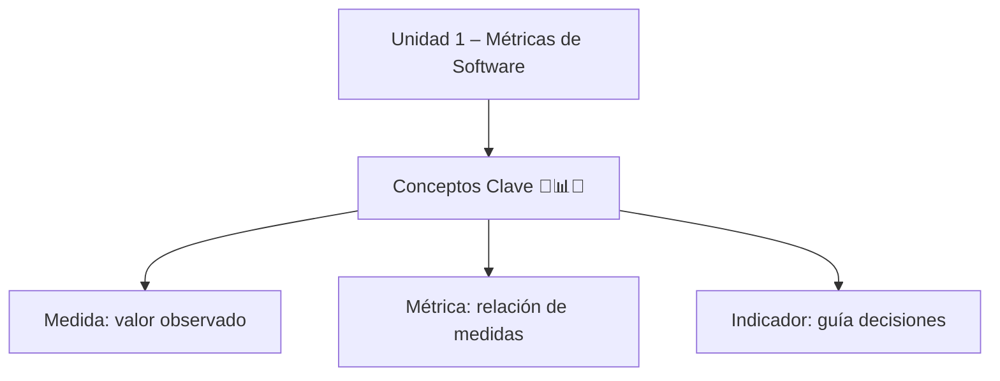

```mermaid
flowchart  TD

A[Unidad 1 – Métricas de Software]  -->  B[Conceptos Clave 📏📊✅]

B  -->  B1[Medida: valor observado]

B  -->  B2[Métrica: relación de medidas]

B  -->  B3[Indicador: guía decisiones]
```
<!--stackedit_data:
eyJoaXN0b3J5IjpbLTEyNjQyMTkyOF19
-->