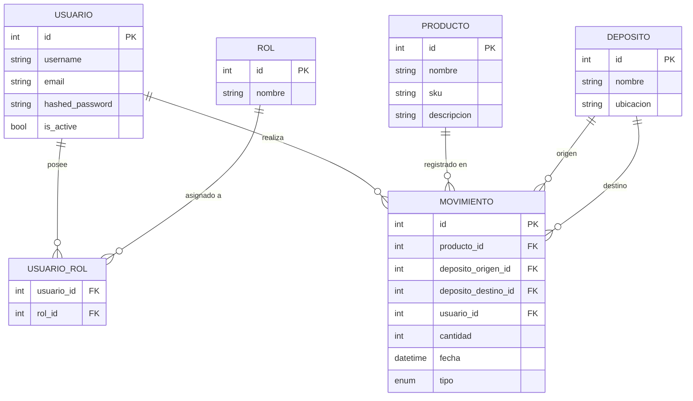

# 📅 Semana 2 – Diseño del modelo de dominio

## ✅ ¿Es conveniente usar **SQLite** en lugar de MySQL?

**Sí, absolutamente.** Para un entorno educativo y de práctica como el tuyo, **SQLite es ideal** por varias razones:

### 🔹 Ventajas de usar SQLite

| Beneficio                          | Por qué es útil en tu caso                         |
| ---------------------------------- | -------------------------------------------------- |
| 🧱 Sin servidor externo            | No necesita instalar ni levantar MySQL/PostgreSQL. |
| ⚡ Fácil de iniciar                 | Se crea como un simple archivo `.db`.              |
| 🎒 Ligero y portátil               | Funciona igual en cualquier sistema operativo.     |
| 💻 Menos dependencias              | Solo necesitás `sqlite3` y `SQLAlchemy`.           |
| 📚 Ideal para FastAPI + SQLAlchemy | Se integra muy bien y rápido para pruebas.         |

### 🔻 ¿Y las desventajas?

| Limitación                                   | ¿Importa en tu caso?          |
| -------------------------------------------- | ----------------------------- |
| No sirve para alta concurrencia              | ❌ No es necesario             |
| No soporta todas las funciones SQL avanzadas | ❌ No las usarás probablemente |
| No se usa en producción real                 | ✅ Pero no es el objetivo      |

✅ **Conclusión:** Usar **SQLite en desarrollo** es **totalmente recomendable**. Si querés, podés dejar la base preparada para cambiar a MySQL más adelante (con configuración en `.env`).

---

## 📘 Contenido en Markdown: Modelo de Dominio y Casos de Uso

### 📄 `docs/semana-01/modelo-dominio.md`

```markdown
# 🧩 Modelo de Dominio - Sistema de Inventario

## Entidades principales

### 🛒 Producto
- `id` (int)
- `nombre` (str)
- `sku` (str, único)
- `descripcion` (str, opcional)
- `stock_global` (int, calculado)

### 🏢 Depósito
- `id` (int)
- `nombre` (str)
- `ubicacion` (str)

### 🔁 Movimiento de Stock
- `id` (int)
- `producto_id` (FK Producto)
- `deposito_origen_id` (FK Depósito, opcional)
- `deposito_destino_id` (FK Depósito, opcional)
- `cantidad` (int)
- `fecha` (datetime)
- `tipo` (str: 'ingreso', 'egreso', 'traslado')

## Relaciones

- Un `Producto` puede tener movimientos de stock (ingresos, egresos, traslados).
- Un `Movimiento` puede estar vinculado a uno o dos depósitos.
```

---

### 📄 `docs/semana-01/casos-de-uso.md`

```markdown
# ✅ Casos de Uso - Sistema de Inventario

## 🧍‍♂️ Actores
- **Administrador**: gestiona productos y depósitos.
- **Operario**: realiza movimientos de stock.

## 🔹 Casos de uso

### 1. Registrar producto
- Actor: Administrador
- Descripción: Crea un nuevo producto en el sistema.
- Flujo: Ingresar nombre, SKU, descripción.

---

### 2. Registrar depósito
- Actor: Administrador
- Descripción: Crea un nuevo depósito para almacenar productos.

---

### 3. Ingresar stock
- Actor: Operario
- Descripción: Registra el ingreso de cierto producto a un depósito.

---

### 4. Egresar stock
- Actor: Operario
- Descripción: Registra la salida de un producto desde un depósito.

---

### 5. Trasladar producto
- Actor: Operario
- Descripción: Mueve stock entre depósitos.

---

### 6. Consultar inventario
- Actor: Todos
- Descripción: Muestra el stock total por producto y por depósito.
```

---


## 🧩 **Modelo de clases: Sistema de Inventario + Seguridad**

Incluye:

* Clases para:

  * `Producto`, `Deposito`, `Movimiento`
  * `Usuario`, `Rol` y `Asociación Usuario-Rol`
* Relaciones completas y buenas prácticas con SQLAlchemy ORM
* Listo para usar con SQLite y escalar a cualquier RDBMS

---

### 📁 Estructura sugerida

```bash
backend/
└── app/
    └── db/
        └── models/
            ├── base.py
            ├── producto.py
            ├── deposito.py
            ├── movimiento.py
            ├── usuario.py
            └── __init__.py
```

---

## ✅ `base.py` – Base común

Perfecto. Aquí tenés el contenido completo y profesional de tu archivo `base.py`, con los métodos adicionales útiles para depuración, comparación, hashing y serialización. Listo para copiar y usar en tu proyecto educativo.

---

### ✅ `app/db/models/base.py`

```python
# app/db/models/base.py

from sqlalchemy.orm import DeclarativeBase
from sqlalchemy import Column, Integer
import json

class Base(DeclarativeBase):
    """Clase base para todos los modelos, con atributos y métodos comunes."""

    id = Column(Integer, primary_key=True, index=True)

    def __repr__(self):
        return f"<{self.__class__.__name__}(id={self.id})>"

    def __eq__(self, other):
        if isinstance(other, self.__class__):
            return self.id == other.id
        return False

    def __hash__(self):
        return hash((self.__class__, self.id))

    def to_dict(self):
        """Devuelve una representación en diccionario del modelo."""
        return {
            column.name: getattr(self, column.name)
            for column in self.__table__.columns
        }

    def to_json(self):
        """Devuelve una representación JSON del modelo."""
        return json.dumps(self.to_dict(), default=str)
```

---

### 🧠 ¿Qué resuelve?

| Función     | Para qué sirve                                |
| ----------- | --------------------------------------------- |
| `id`        | ID común para todas las tablas                |
| `__repr__`  | Te muestra algo útil en logs o consola        |
| `__eq__`    | Compara objetos por clase e ID                |
| `__hash__`  | Permite usar objetos como claves en sets/maps |
| `to_dict()` | Muy útil para debugging o APIs                |
| `to_json()` | Convertí modelos a JSON fácilmente            |

---

Con esto ya tenés una **clase base profesional, clara y útil**, ideal para enseñar buenas prácticas en ingeniería de software. ¿Querés que te genere ahora los `schemas` Pydantic correspondientes o los primeros endpoints con FastAPI?


---

## ✅ `producto.py`

```python
# app/db/models/producto.py
from sqlalchemy import Column, Integer, String
from app.db.models.base import Base

class Producto(Base):
    __tablename__ = "productos"
    
    nombre = Column(String, nullable=False)
    sku = Column(String, unique=True, nullable=False)
    descripcion = Column(String)
```

---

## ✅ `deposito.py`

```python
# app/db/models/deposito.py
from sqlalchemy import Column, Integer, String
from app.db.models.base import Base

class Deposito(Base):
    __tablename__ = "depositos"
    
    nombre = Column(String, nullable=False)
    ubicacion = Column(String)
```

---

## ✅ `movimiento.py`

```python
# app/db/models/movimiento.py
from sqlalchemy import Column, Integer, ForeignKey, DateTime, Enum
from sqlalchemy.orm import relationship
from datetime import datetime
from enum import Enum as PyEnum

from app.db.models.base import Base

class TipoMovimiento(PyEnum):
    ingreso = "ingreso"
    egreso = "egreso"
    traslado = "traslado"

class Movimiento(Base):
    __tablename__ = "movimientos"
    
    producto_id = Column(Integer, ForeignKey("productos.id"), nullable=False)
    deposito_origen_id = Column(Integer, ForeignKey("depositos.id"), nullable=True)
    deposito_destino_id = Column(Integer, ForeignKey("depositos.id"), nullable=True)
    cantidad = Column(Integer, nullable=False)
    fecha = Column(DateTime, default=datetime.utcnow)
    tipo = Column(Enum(TipoMovimiento), nullable=False)

    producto = relationship("Producto")
    deposito_origen = relationship("Deposito", foreign_keys=[deposito_origen_id])
    deposito_destino = relationship("Deposito", foreign_keys=[deposito_destino_id])
```

---

## ✅ `usuario.py` (seguridad)

```python
# app/db/models/usuario.py
from sqlalchemy import Column, Integer, String, Boolean, Table, ForeignKey
from sqlalchemy.orm import relationship
from app.db.models.base import Base

# Tabla intermedia Usuario-Rol
usuario_rol = Table(
    "usuario_rol",
    Base.metadata,
    Column("usuario_id", ForeignKey("usuarios.id"), primary_key=True),
    Column("rol_id", ForeignKey("roles.id"), primary_key=True)
)

class Usuario(Base):
    __tablename__ = "usuarios"

    id = Column(Integer, primary_key=True, index=True)
    username = Column(String, unique=True, index=True, nullable=False)
    email = Column(String, unique=True, index=True)
    hashed_password = Column(String, nullable=False)
    is_active = Column(Boolean, default=True)

    roles = relationship("Rol", secondary=usuario_rol, back_populates="usuarios")

class Rol(Base):
    __tablename__ = "roles"

    id = Column(Integer, primary_key=True)
    nombre = Column(String, unique=True, nullable=False)

    usuarios = relationship("Usuario", secondary=usuario_rol, back_populates="roles")
```

---

## 🛡️ Seguridad adicional (opcional futuro)

Más adelante podés usar FastAPI con OAuth2/JWT y esta estructura ya se adapta fácilmente.

---

Perfecto, vamos paso a paso. Como ya tenés el modelo de clases listo, ahora te voy a ayudar a completar lo necesario para que **puedas probar todo eso y ver cómo se crea la base de datos automáticamente con SQLite.**

---

## 🎯 Objetivo inmediato

1. Crear automáticamente las tablas en SQLite.
2. Tener un script inicial que puedas ejecutar con Python.
3. Entender cómo probar que todo funciona.

---

## ✅ Paso 1: Asegurá dependencias en `requirements.txt`

Si todavía no lo hiciste, tu archivo `requirements.txt` debe incluir al menos esto:

```txt
fastapi
uvicorn
sqlalchemy
pydantic
python-dotenv
```

Y si vas a usar SQLite (no hace falta instalar nada más porque viene con Python).

---

## ✅ Paso 2: Archivo `create_db.py`

Creá este archivo en `backend/app/create_db.py`:

```python
# app/create_db.py

from app.db.models.base import Base
from app.db.models import producto, deposito, movimiento, usuario
from sqlalchemy import create_engine
import os

# Si usás dotenv (.env), esto también puede venir de allí.
DATABASE_URL = os.getenv("DATABASE_URL", "sqlite:///./test.db")

engine = create_engine(DATABASE_URL, echo=True)

def create_database():
    print("Creando base de datos...")
    Base.metadata.create_all(bind=engine)
    print("Listo ✅")

if __name__ == "__main__":
    create_database()
```

---

## ✅ Paso 3: Archivo `.env`

Ubicado en `backend/.env`:

```env
DATABASE_URL=sqlite:///./test.db
```

---

## ✅ Paso 4: Ejecutar

Abrí una terminal en `backend/` y ejecutá:

```bash
python -m app.create_db
```

Esto debería:

* Crear un archivo `test.db` (base de datos SQLite).
* Mostrar en consola cómo SQLAlchemy crea todas las tablas (`productos`, `depositos`, etc).

---

## ✅ Paso 5: Verificá con DB Browser for SQLite

Si querés ver visualmente el resultado:

1. Instalar [DB Browser for SQLite](https://sqlitebrowser.org/dl/)
2. Abrís `test.db` desde ahí y vas a ver las tablas creadas con los campos que definiste.

---
### Clases
```mermaid
classDiagram
    class Usuario {
        +int id
        +string username
        +string email
        +string hashed_password
        +bool is_active
    }
    class Rol {
        +int id
        +string nombre
    }
    class UsuarioRol {
        +int usuario_id
        +int rol_id
    }
    class Producto {
        +int id
        +string nombre
        +string sku
        +string descripcion
    }
    class Deposito {
        +int id
        +string nombre
        +string ubicacion
    }
    class Movimiento {
        +int id
        +int producto_id
        +int deposito_origen_id
        +int deposito_destino_id
        +int cantidad
        +datetime fecha
        +string tipo
    }

    Usuario "1" -- "*" UsuarioRol : tiene
    Rol "1" -- "*" UsuarioRol : tiene

    Producto "1" -- "*" Movimiento : relacionado
    Deposito "1" -- "*" Movimientoorigen"
    Deposito "1" -- "*" M : ovimient- : destino
```

### DER



----------

### ✅ **Último estado conocido del proyecto**

-   Ya tienes armada tu **base de datos** con **SQLAlchemy ORM**.
    
-   Todos los modelos están en `app/db/models/` y se ven así: `Producto`, `Movimiento`, `Usuario`, etc.
    
-   Probablemente el archivo `init_db()` ya te creó las tablas correctamente.
    

----------

### 🧱 ¿Qué es lo que sigue?

Ahora vas a **separar las capas del modelo** para tener un diseño limpio y mantenible:

#### 1. **ORM** (`app/db/models/`)

-   Define cómo se almacenan los datos en la base de datos (ya lo tenés).
    
-   Son clases que heredan de `Base`, usan `Column`, `ForeignKey`, `relationship`, etc.
    
-   Ejemplo: `ProductoORM`, `MovimientoORM`, etc.
    

#### 2. **Domain models (entidades)** (`app/domain/models/`)

-   Representan el modelo de negocio **sin acoplamiento a SQLAlchemy**.
    
-   No tienen decoradores ni columnas; son clases simples de Python (POPOs).
    
-   Se usan para aplicar lógica de negocio pura.
    
-   Ejemplo: `Producto`, `Movimiento`, `Usuario`, etc.
    

#### 3. **Schemas (DTOs)** (`app/schemas/`)

-   Son modelos **Pydantic** que se usan para validar y serializar datos de entrada/salida (API, formularios, etc.).
    
-   Ayudan a definir qué campos esperamos recibir o enviar.
    
-   Se pueden basar en el domain model o directamente en el ORM si es necesario.
    

----------

### 🔄 Relación entre las capas

```plaintext
       Entrada/Salida (FastAPI, API, consola)
                       ⬇
                   [ Pydantic ]
                      Schemas
                       ⬇
       [ Dominio / Entidades de negocio ]
                 (clases puras)
                       ⬇
               [ ORM / Persistencia ]
         (SQLAlchemy: db/models/*.py)

```

----------

### ✅ ¿Qué necesitamos ahora?

Si querés, pasame la estructura del modelo de base de datos que tenés (las clases ORM), así armamos:

1.  Las entidades de dominio (`domain/models/`)
    
2.  Los esquemas Pydantic (`schemas/`)
    
3.  Y los _mappers_ para convertir entre capas
    

### 📁 Estructura sugerida

```
project/
├── app/
│   ├── db/
│   │   └── models/          ← Modelos ORM (SQLAlchemy)
│   ├── domain/
│   │   └── models/          ← Modelos de dominio (sin decoradores ni ORM)
│   └── schemas/             ← Esquemas Pydantic (para entrada/salida de datos)

```

----------

### ✅ ¿Qué es un modelo de dominio?

Un modelo de dominio representa **la lógica del negocio** en su forma más limpia, sin preocuparse por cómo se guarda en la base de datos (ORM) ni cómo se valida/transfiere (Pydantic).

----------

### 🛠️ Vamos a crear el modelo de dominio `Producto`

#### ORM (`app/db/models/producto.py`)

```python
class ProductoORM(Base):
    __tablename__ = "productos"
    
    nombre = Column(String, nullable=False)
    sku = Column(String, unique=True, nullable=False)
    descripcion = Column(String)

    movimientos = relationship("Movimiento", back_populates="producto")

```

#### Dominio (`app/domain/models/producto.py`)

```python
from dataclasses import dataclass

@dataclass
class Producto:
    id: int
    nombre: str
    sku: str
    descripcion: str | None = None

```

----------

¿Querés que avance generando todos los modelos de dominio (`Producto`, `Movimiento`, `Deposito`, `Usuario`, `Rol`) de esta forma?

<!--stackedit_data:
eyJoaXN0b3J5IjpbLTExMTA2NzY1NSw1OTgxMTQyNjJdfQ==
-->