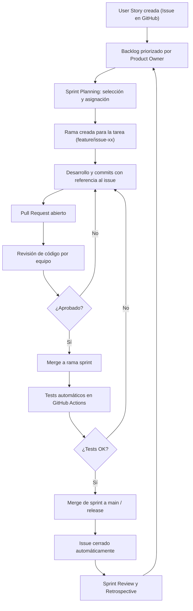

# 📘 Plan Completo Proyecto IS2. Scrum - Kanban
>La metodología ágil que se está aplicando es una **mezcla bastante clásica basada en Scrum**, pero adaptada con prácticas de **Kanban** para gestión de issues y tareas. 

## 🔹 Semana 1 – Setup inicial y análisis

### 🧑‍💼 Historia de usuario

**Como** estudiante de Ingeniería de Software II,
**quiero** configurar correctamente mi entorno de desarrollo,
**para** poder trabajar en equipo desde el primer día con buenas prácticas.

### 📝 Brief del sprint

Sentar bases del proyecto: herramientas, entorno, análisis del problema y flujo básico Git.

### ✅ Backlog (Issues)

* [#1](https://github.com/vhcontre/ingenieria-de-software-2/issues/1) Crear estructura inicial del repositorio y entorno
* [#2](https://github.com/vhcontre/ingenieria-de-software-2/issues/2) Implementar modelo ORM de Producto
* [#3](https://github.com/vhcontre/ingenieria-de-software-2/issues/3) Crear modelo de dominio de Producto
* [#4](https://github.com/vhcontre/ingenieria-de-software-2/issues/4) Implementar esquema Pydantic de Producto
* [#5](https://github.com/vhcontre/ingenieria-de-software-2/issues/5) Crear mappers entre Producto ORM y dominio

---

## 🔹 Semana 2 – Modelado y arquitectura básica

### 🧑‍💼 Historia de usuario

**Como** desarrollador,
**quiero** diseñar los modelos del dominio y configurar la arquitectura básica,
**para** comenzar a desarrollar sobre una base sólida y desacoplada.

### 📝 Brief del sprint

Estructura backend básica (FastAPI + SQLAlchemy), modelos y base de datos.

### ✅ Backlog (Issues)

* [#6](https://github.com/vhcontre/ingenieria-de-software-2/issues/6) Agregar repositorio de productos
* [#7](https://github.com/vhcontre/ingenieria-de-software-2/issues/7) Implementar consola inicial para productos
* [#8](https://github.com/vhcontre/ingenieria-de-software-2/issues/8) Validación de unicidad de nombre y SKU
* [#9](https://github.com/vhcontre/ingenieria-de-software-2/issues/9) Agregar paginación y numeración a listados

---

## 🔹 Semana 3 – CRUD de entidades básicas

### 🧑‍💼 Historia de usuario

**Como** usuario del sistema,
**quiero** poder gestionar productos y depósitos,
**para** tener un inventario inicial cargado en el sistema.

### 📝 Brief del sprint

Operaciones CRUD para Productos y Depósitos.

### ✅ Backlog (Issues)

* [#10](https://github.com/vhcontre/ingenieria-de-software-2/issues/10) Crear modelo de dominio, ORM y schema de Movimiento
* [#11](https://github.com/vhcontre/ingenieria-de-software-2/issues/11) Crear mappers entre Movimiento y MovimientoORM

---

## 🔹 Semana 4 – Gestión de movimientos

### 🧑‍💼 Historia de usuario

**Como** operador,
**quiero** registrar ingresos y egresos de productos,
**para** mantener actualizado el stock.

### 📝 Brief del sprint

Reglas de negocio para movimientos, validaciones y lógica.

### ✅ Backlog (Issues)

* [#12](https://github.com/vhcontre/ingenieria-de-software-2/issues/12) Implementar MovimientoRepository
* [#13](https://github.com/vhcontre/ingenieria-de-software-2/issues/13) Agregar pruebas unitarias para MovimientoRepository
* [#14](https://github.com/vhcontre/ingenieria-de-software-2/issues/14) Documentar reglas de negocio en MovimientoRepository

---

## 🔹 Semana 5 – Seguridad y autenticación

### 🧑‍💼 Historia de usuario

**Como** administrador,
**quiero** que solo usuarios autorizados accedan al sistema,
**para** proteger la información del inventario.

### 📝 Brief del sprint

Configuración de autenticación JWT y autorización por roles.

### ✅ Backlog (Issues)

* [#15](https://github.com/vhcontre/ingenieria-de-software-2/issues/15) Definir modelos de Usuario y Rol
* [#16](https://github.com/vhcontre/ingenieria-de-software-2/issues/16) Implementar login con JWT
* [#17](https://github.com/vhcontre/ingenieria-de-software-2/issues/17) Agregar middleware o dependencias de autorización
* [#18](https://github.com/vhcontre/ingenieria-de-software-2/issues/18) Agregar pruebas a endpoints autenticados

---

## 🔹 Semana 6 – Integración y pruebas

### 🧑‍💼 Historia de usuario

**Como** desarrollador,
**quiero** asegurarme de que las funcionalidades estén integradas,
**para** detectar errores tempranos antes de agregar nuevas capas.

### 📝 Brief del sprint

Integración, pruebas automatizadas y CI con GitHub Actions.

### ✅ Backlog (Issues)

* [#19](https://github.com/vhcontre/ingenieria-de-software-2/issues/19) Crear test de integración para flujo completo
* [#20](https://github.com/vhcontre/ingenieria-de-software-2/issues/20) Documentar endpoints con summary y description
* [#21](https://github.com/vhcontre/ingenieria-de-software-2/issues/21) Configurar workflow de GitHub Actions
* [#22](https://github.com/vhcontre/ingenieria-de-software-2/issues/22) Añadir workflow de cobertura de código (opcional)
* [#23](https://github.com/vhcontre/ingenieria-de-software-2/issues/23) Ajustar schemas Pydantic para ejemplos

---

## 🔹 Semana 7 – Interfaz web con Jinja2

### 🧑‍💼 Historia de usuario

**Como** usuario web,
**quiero** visualizar productos desde una interfaz web,
**para** no depender de la consola o herramientas externas.

### 📝 Brief del sprint

Inicio de la interfaz web con plantillas y navegación.

### ✅ Backlog (Issues)

(Nuevos números)

* \#29 Integrar Jinja2Templates en FastAPI
* \#30 Crear plantilla base (`base.html`) para herencia y layout común
* \#31 Crear vista `productos.html` con tabla dinámica
* \#32 Implementar navegación básica entre secciones
* \#33 Incluir carpeta para archivos estáticos
* \#34 Tests manuales para verificar renderizado y navegación

---

## 🔹 Semana 8 – Formularios web para movimientos

### 🧑‍💼 Historia de usuario

**Como** usuario web,
**quiero** registrar movimientos mediante formulario,
**para** actualizar stock sin usar consola.

### 📝 Brief del sprint

Formularios web con validaciones y manejo de errores.

### ✅ Backlog (Issues)

(Nuevos números)

* \#35 Crear plantilla `movimiento_form.html` con formulario
* \#36 Ruta POST `/web/movimientos` para procesar formulario
* \#37 Validaciones backend para movimientos
* \#38 Mostrar mensajes de error sin perder datos
* \#39 Redirección tras alta exitosa
* \#40 Pruebas manuales y unitarias para formulario y backend

---

## 🔹 Semana 9 – Reportes y mejoras visuales

### 🧑‍💼 Historia de usuario

**Como** administrador,
**quiero** visualizar reportes y exportar datos,
**para** tomar decisiones a partir del stock y los movimientos recientes.

### 📝 Brief del sprint

Reportes HTML y exportación CSV, mejoras de navegación y flujo Git.

### ✅ Backlog (Issues)

* [#24](https://github.com/vhcontre/ingenieria-de-software-2/issues/24) Crear reporte de productos con stock bajo
* [#25](https://github.com/vhcontre/ingenieria-de-software-2/issues/25) Crear vista de movimientos recientes
* [#26](https://github.com/vhcontre/ingenieria-de-software-2/issues/26) Crear exportador CSV de movimientos
* [#27](https://github.com/vhcontre/ingenieria-de-software-2/issues/27) Crear navegación entre vistas web
* [#28](https://github.com/vhcontre/ingenieria-de-software-2/issues/28) Crear rama y hacer PR desde semana-9

---

## 🔹 Semana 10 – Dockerización y CI/CD

### 🧑‍💼 Historia de usuario

**Como** desarrollador del equipo,
**quiero** dockerizar el backend y la base de datos,
**para** tener un entorno reproducible y facilitar la integración continua y despliegue.

### 📝 Brief del sprint

Contenerización de backend y DB con Docker y configuración CI.

### ✅ Backlog (Issues)

* Crear `Dockerfile` para la aplicación backend (FastAPI)
* Crear `docker-compose.yml` para orquestar backend + base de datos PostgreSQL
* Configurar variables sensibles en archivo `.env` para evitar hardcodear credenciales
* Definir volúmenes persistentes para la base de datos
* Modificar configuración del proyecto para que se adapte a entorno dockerizado (p.ej. conexión DB)
* Configurar GitHub Actions para correr tests dentro de contenedores o con imagen docker
* Documentar en README los pasos para levantar el entorno con Docker y docker-compose
* Probar ejecución completa: levantar contenedores, acceder a la app, CRUD funcionando
* Realizar commit con referencia a Issue # correspondiente y abrir Pull Request

---

## 🔹 Semana 11 – Mejoras UI/UX y refactor

### 🧑‍💼 Historia de usuario

**Como** usuario,
**quiero** una interfaz más amigable y clara,
**para** facilitar la navegación y el uso.

### 📝 Brief del sprint

Mejoras visuales, recursos estáticos, ayuda contextual y refactor técnico.

### ✅ Backlog (Issues)

(Números inventados)

* \#41 Incorporar CSS para mejor diseño visual
* \#42 Añadir recursos estáticos (imágenes, íconos)
* \#43 Implementar ayuda contextual en vistas
* \#44 Mejorar menús y navegación
* \#45 Refactorizar nombres y estructura del código
* \#46 Añadir tests frontend y usabilidad
* \#47 Actualizar documentación UI/UX

---

## 🔹 Semana 12 – Cierre, documentación y presentación final

### 🧑‍💼 Historia de usuario

**Como** equipo de desarrollo,
**quiero** entregar documentación completa y presentación clara,
**para** demostrar el avance y la calidad del proyecto.

### 📝 Brief del sprint

Finalización documentación, video demo, retrospectiva y presentación.

### ✅ Backlog (Issues)

(Números inventados)

* \#48 Completar README con instrucciones
* \#49 Crear manual de usuario con screenshots
* \#50 Actualizar diagramas técnicos
* \#51 Grabar video demo funcional
* \#52 Organizar retrospectiva de equipo
* \#53 Documentar lecciones aprendidas
* \#54 Preparar presentación final

----

### Características que indican Scrum:

-   **Sprints semanales** (semanas 1 a 12) con objetivos claros y backlog definido para cada sprint.
    
-   **Historias de usuario** que describen necesidades y roles.
    
-   **Sprint backlog** con tareas específicas a completar en cada semana.
    
-   Uso de **milestones (hitos)** y **issues** que funcionan como tareas o historias.
    
-   **Revisión y entrega continua** al final de cada sprint (semanal).
    
-   Uso de **pull requests** para integrar cambios de manera controlada.
    
-   Validación mediante pruebas automatizadas y CI/CD.
    

### Características que recuerdan Kanban:

-   Gestión visual de tareas con **issues y tarjetas** que se mueven entre estados (To Do, In Progress, Done).
    
-   Flujo continuo de trabajo, sin esperar necesariamente a que termine el sprint para integrar cambios (aunque hay PR y milestones).
    

### En resumen:

-   Se trata de un **Scrum adaptado para un proyecto educativo y técnico**, con entregas frecuentes (semanales), backlog priorizado, historias de usuario, y uso de pull requests.
    
-   Se combinan aspectos de Kanban para la gestión visual y control del flujo de tareas.
    
-   La integración con GitHub Issues y Actions ayuda a mantener el ritmo ágil y la calidad.
    

<!--stackedit_data:
eyJoaXN0b3J5IjpbLTE5NDQxMDM0NjcsMTMxODA0NjgwMywtMT
QwODg2MjgzM119
-->