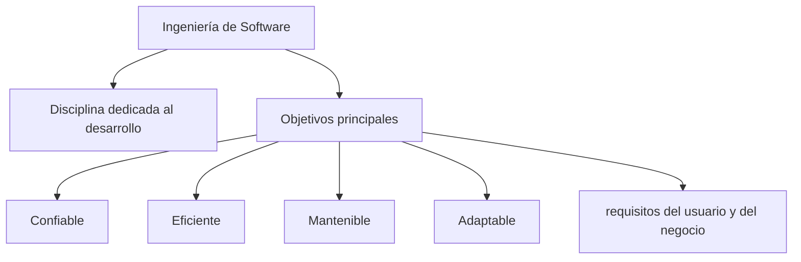
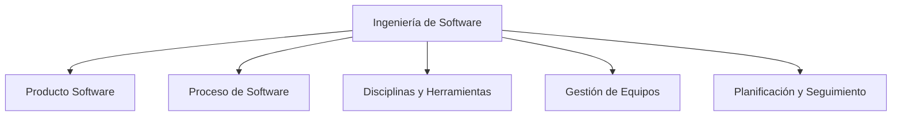
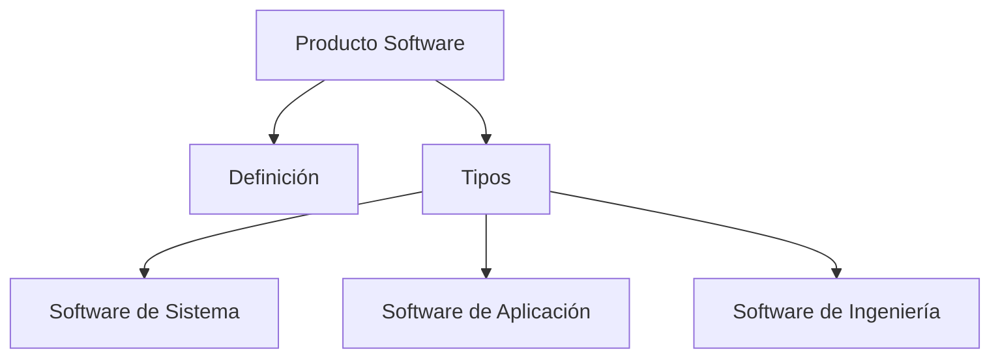
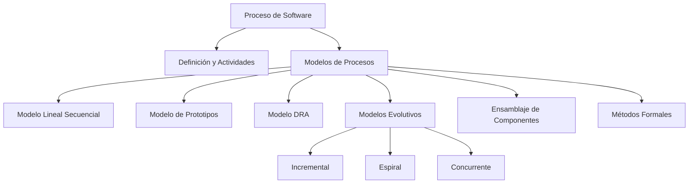
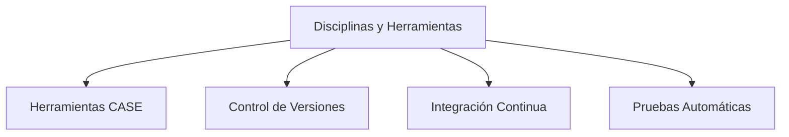
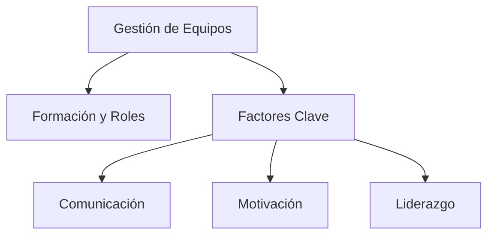

## ¿Qué es la Ingeniería de Software?

La **Ingeniería de Software** es una disciplina de la ingeniería dedicada al desarrollo, operación y mantenimiento de sistemas de software de manera sistemática, rigurosa y cuantificable.

Su objetivo principal es aplicar principios, métodos y herramientas para construir software que sea:

* **Confiable:** que funcione correctamente bajo condiciones especificadas.
* **Eficiente:** que use adecuadamente los recursos disponibles.
* **Mantenible:** que pueda ser modificado y mejorado fácilmente.
* **Adaptable:** que pueda evolucionar ante nuevos requerimientos o tecnologías.
* **Cumplir con los requisitos del usuario y del negocio.**

Se encarga de todo el ciclo de vida del software, desde la **planificación y análisis** hasta el **diseño, implementación, pruebas, despliegue y mantenimiento**.

---

“speech”:

**Ingeniería de Software es la disciplina que nos permite construir software de forma ordenada y profesional. No es solo programar, sino planificar, diseñar, probar y mantener sistemas que sean confiables y útiles para los usuarios. Es la base para crear soluciones tecnológicas que funcionen bien y puedan adaptarse a los cambios.**

---

# Guion Introductorio para Ingeniería de Software II

**(Saludo y conexión personal)**
“Hola a todos, bienvenidos a Ingeniería de Software II. Hoy vamos a entrar en un mundo que va mucho más allá de escribir código: cómo construir software de forma profesional y organizada.”

**(¿Qué es Ingeniería de Software?)**
“La Ingeniería de Software es la disciplina que estudia y aplica métodos, técnicas y herramientas para desarrollar software de calidad. No se trata solo de programar, sino de planificar, diseñar, implementar, probar y mantener sistemas que resuelvan problemas reales.”

**(¿Por qué es importante?)**
“En el mundo actual, el software está en todas partes: teléfonos, autos, hospitales, bancos... Un error en el software puede causar problemas serios. Por eso necesitamos ingenieros de software que sepan cómo hacer las cosas bien.”

**(¿Qué veremos en este curso?)**
“A lo largo del curso veremos desde cómo analizar problemas, diseñar sistemas, gestionar equipos, hasta desplegar y mantener aplicaciones. También aprenderemos buenas prácticas y metodologías que nos ayudarán a trabajar en equipo y a entregar software confiable.”

**(Motivación)**
“Mi objetivo es que no solo aprendan teoría, sino que vean cómo aplicarla en proyectos reales, y que puedan sentirse seguros para enfrentar cualquier desafío de desarrollo.”

**(Invitación a la participación)**
“Les invito a que pregunten, discutan, experimenten y aporten sus ideas. La Ingeniería de Software es un trabajo de equipo, y todos vamos a aprender juntos.”

---

Perfecto, acá te dejo unas preguntas y actividades iniciales para dinamizar la clase y motivar a los estudiantes:

---

## Preguntas disparadoras para iniciar la clase

1. **¿Alguna vez usaron una app o programa que les haya fallado? ¿Qué pasó?**
   (Motiva a compartir experiencias para entender el impacto del software mal hecho.)

2. **¿Qué creen que hace que un software sea “bueno” o “malo”?**
   (Genera debate sobre calidad, usabilidad, confiabilidad, etc.)

3. **¿Por qué creen que solo “programar” no es suficiente para hacer un buen sistema?**
   (Introduce la idea de la Ingeniería de Software más allá del código.)

4. **¿Quiénes trabajan en equipo para crear una app o sistema? ¿Qué roles creen que existen?**
   (Permite hablar de roles y gestión de proyectos.)

---

## Actividades breves para romper el hielo

### Actividad 1: Mini lluvia de ideas

* En grupos de 3 o 4, que escriban en 5 minutos qué características debería tener un software ideal.
* Luego compartir en plenaria.

### Actividad 2: Caso de estudio rápido

* Presentar un breve caso donde un error de software causó un problema real (por ejemplo: falla en un cajero automático, o app de banca).
* Preguntar: ¿Cómo creen que se pudo evitar? ¿Qué rol podría tener la Ingeniería de Software?

### Actividad 3: Autoevaluación inicial

* Preguntar a cada alumno qué experiencia tienen con desarrollo de software y qué esperan aprender en el curso.
* Puede hacerse rápido, al aire o por chat si es virtual.

---

---

---

---

---

<!--stackedit_data:
eyJoaXN0b3J5IjpbMTc2NzkxNDIxNiwzMDY2MzE2NjQsLTE5Nz
g0MjczMjIsLTE0NDg3NDU2OTMsNTQ2MDE3MDcyXX0=
-->