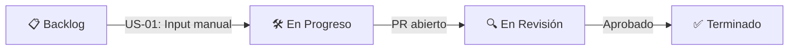
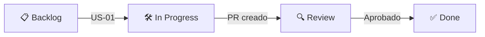

**Kanban en GitHub Projects**. Workflow de *"Análisis de Matrices Cuadradas"* a un tablero Kanban en GitHub.

---

### **1. Configuración Inicial en GitHub**  
1. **Crear un repositorio** para el proyecto (ej: `analisis-matrices-python`).  
2. Ir a la pestaña **"Projects"** > **"New project"** > Elegir plantilla **"Kanban"**.  
3. Nombrar el proyecto (ej: `Matrices Cuadradas - Kanban`) y configurar visibilidad (público/privado).  

---

### **2. Columnas del Tablero Kanban**  
Por defecto, GitHub sugiere 3 columnas, pero puedes personalizarlas para que coincidan con el flujo del ejercicio:  
```
`📋 Backlog` → `🛠️ En Progreso` → `🔍 En Revisión` → `✅ Terminado`
```
*(Opcional: añadir columnas como "Bloqueado" o "Testing")*.

---

### **3. Tarjetas (Issues) para el Ejercicio**  
Cada **historia de usuario (US)** o **tarea técnica** se convierte en un *issue* en GitHub, asignado al tablero Kanban.  

#### **Ejemplo de Issues (tarjetas)**:  
| **Título del Issue** | **Descripción** | **Asignado** | **Etiquetas** |  
|----------------------|----------------|--------------|---------------|  
| `US-01: Input manual de matriz` | "Como usuario, quiero ingresar valores manualmente..." | `@dev1` | `feature`, `python` |  
| `T-01: Validar tamaño N` | "Función para validar que N sea entero positivo" | `@dev2` | `task`, `validation` |  
| `US-04: Mostrar diagonales` | "Identificar y mostrar diagonal principal/secundaria" | `@dev1` | `feature`, `algorithm` |  

#### **Cómo crearlos**:  
1. Ir a **"Issues"** > **"New Issue"**.  
2. Usar el formato:  
   ```markdown
   ## Descripción  
   [Detalles de la funcionalidad]  

   ## Criterios de Aceptación  
   - [ ] Validar tamaño N.  
   - [ ] Mostrar matriz formateada.  
   ```
3. Asignar **labels** (etiquetas) como `feature`, `bug`, `enhancement`.  
4. Vincular el issue al proyecto Kanban (al crearlo, seleccionar el proyecto).  

---

### **4. Flujo de Trabajo en Kanban**  
- **Backlog**: Issues pendientes de priorizar.  
- **En Progreso**: Tareas activas (arrastrar aquí cuando alguien empiece a trabajar).  
- **En Revisión**: Issues completados que necesitan revisión (ej: PR abierto).  
- **Terminado**: Funcionalidades validadas y listas.  

*(Arrastra las tarjetas entre columnas según su estado)*.  

---

### **5. Ventajas de Usar GitHub Kanban**  
✔ **Integración con código**: Cada issue puede vincularse a un *branch* o *Pull Request*.  
✔ **Automatización**: Usar **GitHub Actions** para mover tarjetas al cerrar un PR.  
✔ **Transparencia**: Todo el equipo ve el progreso en tiempo real.  

---

### **6. Ejemplo Visual del Tablero**  


*(Así se vería el flujo de una tarea)*.  

---

### **7. Tips Adicionales**  
- **Milestones**: Agrupar issues por *hitos* (ej: "Versión 1.0").  
- **Templates**: Usar plantillas predefinidas para issues (estándar en el equipo).  
- **Projects CLI**: Gestionar el tablero desde terminal con [GitHub CLI](https://cli.github.com/).  

---

>Organizar proyecto, integrando el código Python con GitHub. Guía definitiva:

---

### **1. Estructura del Repositorio**
Coloca tu código en esta estructura de carpetas:
```bash
📁 analisis-matrices-python/
├── src/
│   ├── __init__.py       # Archivo vacío (para que Python trate la carpeta como paquete)
│   ├── matriz_ops.py     # Tu código actual (lo pegas aquí tal cual)
│   └── main.py           # Nuevo archivo (explicación abajo)
├── tests/                # (Opcional para futuras pruebas)
│   └── test_matriz.py
├── .github/workflows/    # (Opcional para GitHub Actions)
│   └── python-test.yml
└── README.md             # Base que te envié antes
```

#### **Contenido de `main.py`**:
```python
from src.matriz_ops import analizar_matriz

if __name__ == "__main__":
    print("Análisis de Matrices Cuadradas")
    analizar_matriz()
```

---

### **2. Configuración Inicial en GitHub**
1. **Sube tu código**:
   ```bash
   git init
   git add .
   git commit -m "Initial commit: Código base del proyecto"
   git branch -M main
   git remote add origin https://github.com/tu-usuario/analisis-matrices-python.git
   git push -u origin main
   ```

2. **Activa GitHub Projects**:
   - Ve a tu repositorio > pestaña "Projects" > "New project" > Elige "Kanban".

---

### **3. Seguimiento de Issues (Paso a Paso)**
#### **Ejemplo para el Issue "US-01: Input manual de matriz"**:
1. **Ve al issue en GitHub**.
2. **Crea una rama** directamente desde el issue:
   - Haz clic en "Create a branch" en la sección de desarrollo.
   - Nombre: `feature/US-01-input-manual`.

3. **Trabaja en el código**:
   - Haz `git pull` para traer la rama.
   - Modifica `matriz_ops.py` si necesitas ajustes.

4. **Cierra el issue con un Pull Request**:
   ```bash
   git checkout -b feature/US-01-input-manual
   git add .
   git commit -m "Implementa US-01: Input manual de matriz"
   git push origin feature/US-01-input-manual
   ```
   - Luego, en GitHub, crea un PR desde tu rama a `main`.

---

### **4. Milestones (Hitos)**
1. **Ve a "Issues" > "Milestones" > "New Milestone"**.
2. Crea hitos como:
   - **Versión 1.0**: Agrupa issues básicos (US-01 a US-04).
   - **Validaciones**: Issues de manejo de errores (US-06).

3. **Asigna issues a cada hito**:
   - Edita cada issue y selecciona el milestone correspondiente.

---

### **5. GitHub Actions (Opcional Básico)**
Crea un workflow mínimo para pruebas en `.github/workflows/python-test.yml`:
```yaml
name: Python Tests

on: [push, pull_request]

jobs:
  test:
    runs-on: ubuntu-latest
    steps:
      - uses: actions/checkout@v4
      - name: Set up Python
        uses: actions/setup-python@v4
        with:
          python-version: '3.10'
      - name: Run basic check
        run: |
          cd src
          python -c "from matriz_ops import analizar_matriz; print('✅ Módulo importado correctamente')"
```

---

### **6. Estado Final del Tablero Kanban**


---

### **7. Próximos Pasos**
1. **Personaliza el README.md** con instrucciones de uso.
2. **Agrega más issues** según avances (ej: "US-08: Menú interactivo").
3. **Configura pruebas unitarias** (te puedo ayudar con `pytest` si lo necesitas).

¿Quieres que profundice en algún área en particular? Por ejemplo:
- ¿Cómo agregar un menú interactivo al código?
- ¿Cómo configurar pytest para tus funciones?
- ¿Cómo usar proyectos clásicos vs. los nuevos en GitHub?  

---
>Crear *menú interactivo**, luego **pytest** y finalmente la diferencia entre **proyectos clásicos y nuevos en GitHub**.  

---

## **1. Cómo Agregar un Menú Interactivo al Código**  
**Objetivo**: Permitir al usuario elegir entre ingresar una matriz manualmente o generar una aleatoria, y luego mostrar opciones de análisis.

### **Pasos**:

#### **1.1. Modifica `main.py`**  
Reemplaza el contenido con este código (usa tu lógica original de `matriz_ops.py` pero con un menú):

```python
from src.matriz_ops import (
    ingresar_matriz_manual,
    generar_matriz_aleatoria,
    mostrar_matriz,
    diagonal_principal,
    diagonal_secundaria,
    suma_diagonales
)

def mostrar_menu():
    print("\nMenú de Análisis de Matrices")
    print("1. Ingresar matriz manualmente")
    print("2. Generar matriz aleatoria")
    print("3. Salir")

def main():
    while True:
        mostrar_menu()
        opcion = input("Selecciona una opción: ")

        if opcion == "1":
            n = int(input("\nIngrese el tamaño de la matriz (N x N): "))
            matriz = ingresar_matriz_manual(n)
        elif opcion == "2":
            n = int(input("\nIngrese el tamaño de la matriz (N x N): "))
            min_val = int(input("Valor mínimo aleatorio: "))
            max_val = int(input("Valor máximo aleatorio: "))
            matriz = generar_matriz_aleatoria(n, min_val, max_val)
        elif opcion == "3":
            print("Fin del programa")
            break
        else:
            print("Opción inválida. Intenta nuevamente.")
            continue

        # Mostrar resultados
        mostrar_matriz(matriz)
        dp = diagonal_principal(matriz)
        ds = diagonal_secundaria(matriz)
        suma_p, suma_s = suma_diagonales(matriz)
        print("\nResultados:")
        print(f"Diagonal principal: {dp} (Suma = {suma_p})")
        print(f"Diagonal secundaria: {ds} (Suma = {suma_s})")

if __name__ == "__main__":
    main()
```

#### **1.2. Añade la función `generar_matriz_aleatoria` en `matriz_ops.py`**:
```python
import random

def generar_matriz_aleatoria(n, min_val, max_val):
    return [[random.randint(min_val, max_val) for _ in range(n)] for _ in range(n)]
```

#### **1.3. Prueba el menú**:
```bash
python -m src.main
```
**Salida esperada**:
```
🔢 Menú de Análisis de Matrices
1. Ingresar matriz manualmente
2. Generar matriz aleatoria
3. Salir
```

---

## **2. Cómo Configurar pytest para Tus Funciones**  
**Objetivo**: Crear pruebas automáticas para validar que tus funciones trabajen correctamente.

### **Pasos**:

#### **2.1. Instala pytest**:
```bash
pip install pytest
```

#### **2.2. Crea un archivo de pruebas**:
En la carpeta `tests/`, crea `test_matriz_ops.py`:
```python
import pytest
from src.matriz_ops import (
    diagonal_principal,
    diagonal_secundaria,
    suma_diagonales,
    generar_matriz_aleatoria
)

def test_diagonal_principal():
    matriz = [
        [1, 2, 3],
        [4, 5, 6],
        [7, 8, 9]
    ]
    assert diagonal_principal(matriz) == [1, 5, 9]

def test_suma_diagonales():
    matriz = [
        [1, 2, 3],
        [4, 5, 6],
        [7, 8, 9]
    ]
    assert suma_diagonales(matriz) == (15, 15)

def test_matriz_aleatoria():
    matriz = generar_matriz_aleatoria(3, 1, 10)
    assert len(matriz) == 3
    assert len(matriz[0]) == 3
```

📌**Importante:** Crear un archivo **pytest.ini**
>Crea un archivo llamado pytest.ini en la raíz del proyecto (analisis-matrices-python) con el siguiente contenido: Esto le indica a pytest que incluya el directorio raíz del proyecto (.) en el PYTHONPATH.
```bash
[pytest]
pythonpath = .
```

#### **2.3. Ejecuta las pruebas**:
```bash
pytest tests/test_matriz_ops.py
```
**Salida esperada**:
```
============================= test session starts =============================
platform win32 -- Python 3.13.2, pytest-8.3.5, pluggy-1.5.0
rootdir: .\analisis-matrices-python
configfile: pytest.ini
collected 3 items

tests/test_matriz_ops.py ...                                             [100%]
============================== 3 passed in 0.02s ==============================
```

<br />

## **3. Proyectos Clásicos vs. Nuevos en GitHub**  
**Objetivo**: Entender cuál usar y cómo migrar.

### **Diferencias Clave**:
| **Característica**         | **Proyectos Clásicos**                     | **Proyectos Nuevos (Beta)**               |
|----------------------------|--------------------------------------------|-------------------------------------------|
| **Integración**            | Menos integrado con Issues/PRs             | Totalmente integrado con Issues/PRs       |
| **Vistas**                 | Solo Kanban                                | Kanban, Tablas, Roadmaps                  |
| **Automatización**         | Manual                                     | Reglas automáticas (ej: cerrar issues)    |
| **Ubicación**              | Dentro del repositorio                     | Independiente (puede vincular múltiples repos) |

### **Cómo Crear un Proyecto Nuevo**:
1. Ve a tu perfil de GitHub > "Projects" > "New project".
2. Elige "Board" (Kanban) o "Table".
3. Vincula tu repositorio y asigna issues desde la pestaña "Add items".

---

### **🎯 ¿Qué sigue?**  
1. **Menú interactivo**: ¿Funciona correctamente o necesitas ajustar algo?  
2. **pytest**: ¿Quieres agregar más pruebas (ej: para validar entradas incorrectas)?  
3. **GitHub Projects**: ¿Prefieres usar el nuevo sistema o migrar uno existente?  

¡Dime por cuál quieres empezar! 😊

---

### **🌱 1. Cómo usar Milestones (Hitos)**
**Objetivo**: Agrupar issues por versión o funcionalidad (ej: "Versión 1.0", "Validaciones").

#### **Pasos**:
1. **Crear un Milestone**:
   - Ve a tu repositorio en GitHub > pestaña "Issues" > "Milestones" > "New Milestone".
   - Ejemplo:
     - **Title**: `Versión 1.0 - Funcionalidades Básicas`
     - **Due date**: Opcional (ej: 30 días desde hoy).
     - **Description**: "Incluye ingreso de matrices y cálculo de diagonales".

2. **Asignar Issues a un Milestone**:
   - Abre un issue existente (ej: "US-01: Input manual de matriz").
   - En la barra lateral derecha, busca "Milestone" y selecciona el que creaste.

3. **Ver el progreso**:
   - En "Milestones", verás un porcentaje de completado basado en issues cerrados.

---

### **🔀 2. Crear una rama desde un Issue y vincularla al código**
**Objetivo**: Trabajar en una funcionalidad específica sin afectar el código principal.

#### **Pasos**:
1. **Desde la interfaz de GitHub**:
   - Abre el issue (ej: "US-01").
   - Haz clic en **"Create a branch"** (en la sección "Development").
   - Nombre sugerido: `feature/US-01-input-manual`.

2. **Desde tu terminal local**:
   ```bash
   git checkout main              # Asegúrate de estar en main
   git pull origin main          # Sincroniza cambios
   git checkout -b feature/US-01-input-manual  # Crea y cambia a la rama
   ```

3. **Trabaja en el código**:
   - Modifica los archivos (ej: `src/matriz_ops.py`).
   - Haz commits:
     ```bash
     git add .
     git commit -m "Implementa input manual de matriz (US-01)"
     ```

4. **Vincula la rama al issue**:
   - En el mensaje del commit o PR, incluye `Closes #1` (donde "1" es el número del issue).
   - Esto cerrará automáticamente el issue al mergear el PR.

---

### **⚙️ 3. Configurar GitHub Actions (Tests Automáticos)**
**Objetivo**: Ejecutar pruebas automáticas al hacer `push` o `pull request`.

#### **Ejemplo Básico**:
1. **Crea el archivo de workflow**:
   - En tu repositorio, crea la carpeta: `.github/workflows/`.
   - Dentro, crea un archivo `python-tests.yml`.

2. **Contenido del archivo**:
   ```yaml
   name: Python Tests

   on: [push, pull_request]  # Se ejecuta en estos eventos

   jobs:
     test:
       runs-on: ubuntu-latest
       steps:
         - uses: actions/checkout@v4
         - name: Set up Python
           uses: actions/setup-python@v4
           with:
             python-version: '3.10'
         - name: Run basic checks
           run: |
             cd src
             python -c "from matriz_ops import analizar_matriz; print('✅ Módulo importado correctamente')"
   ```

3. **Sube los cambios**:
   ```bash
   git add .github/workflows/python-tests.yml
   git commit -m "Agrega GitHub Actions para tests básicos"
   git push origin feature/nombre-de-tu-rama
   ```

4. **Verifica los resultados**:
   - Ve a tu repositorio en GitHub > pestaña "Actions".
   - Verás el workflow ejecutándose (✔️ si pasa, ❌ si falla).

---

### **📌 Tips Adicionales**
- **Para Milestones**:
  - Usa milestones como `Versión 1.0`, `Validaciones`, `Mejoras UI`.
- **Para Branches/PRs**:
  - Nombra ramas con el formato `tipo/descripción` (ej: `bugfix/error-diagonales`, `docs/actualiza-readme`).
- **Para GitHub Actions**:
  - Más adelante puedes agregar tests reales con `pytest` (avísame si quieres ayuda con esto).

---

### **🛠️ ¿Qué quieres hacer primero?**
1. ¿Configurar un milestone y asignar issues?  
2. ¿Crear una rama para un issue específico y empezar a codear?  
3. ¿O prefieres probar GitHub Actions con el ejemplo que te di?  


<!--stackedit_data:
eyJoaXN0b3J5IjpbMTQ0NzU5NzQ4XX0=
-->