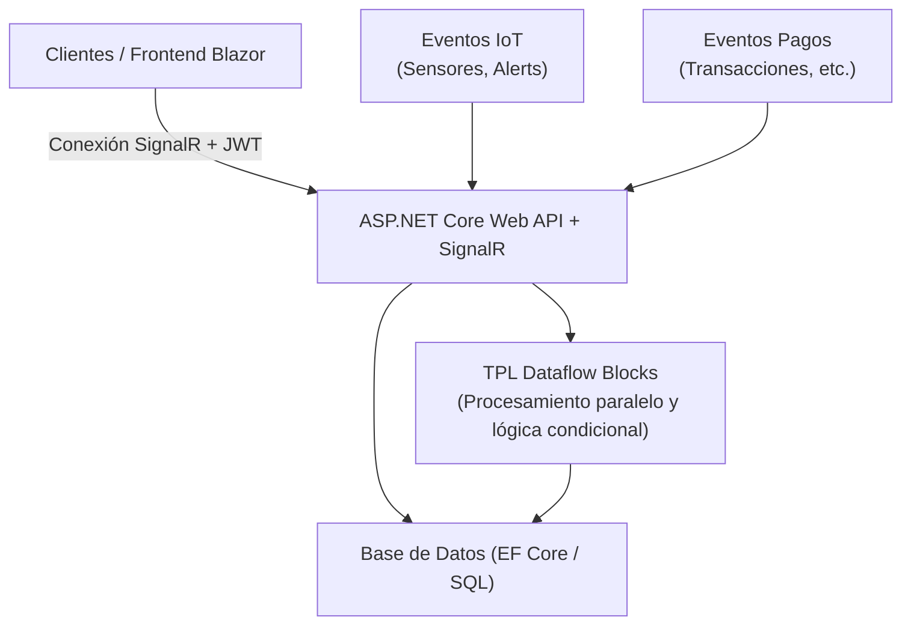
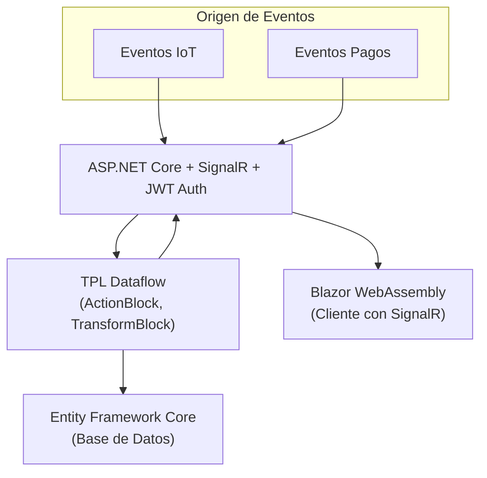
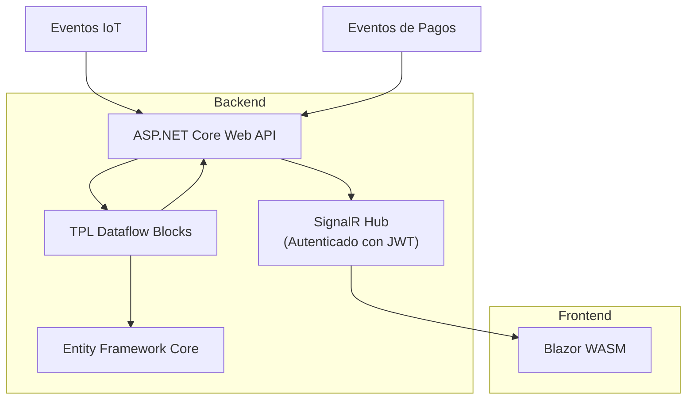

**Persistencia real con Entity Framework Core (EF Core)** en nuestro sistema basado en **ASP.NET Core + SignalR + TPL Dataflow + JWT + Blazor WebAssembly**.

---

## 🔧 Arquitectura Final (Resumen General)

* **Frontend**: Blazor WebAssembly que consume SignalR.
* **Backend**:

  * API ASP.NET Core con SignalR.
  * Canal de procesamiento con **TPL Dataflow**.
  * Seguridad con **JWT Auth**.
  * Persistencia en **SQL Server** usando **EF Core**.
* **Base de datos**: Almacena eventos procesados (como notificaciones de pagos o sensores IoT).
* **Filtros en tiempo real**: El `ActionBlock` decide si persistir y emitir al frontend según tipo/estado.

---

## 🗃️ 1. Crear el Modelo EF Core

```csharp
public class EventLog
{
    public int Id { get; set; }
    public DateTime Timestamp { get; set; }
    public string EventType { get; set; } = default!;
    public string Payload { get; set; } = default!;
}
```

---

## 🧱 2. Configurar DbContext

```csharp
public class AppDbContext : DbContext
{
    public DbSet<EventLog> EventLogs => Set<EventLog>();

    public AppDbContext(DbContextOptions<AppDbContext> options) : base(options) { }

    protected override void OnModelCreating(ModelBuilder modelBuilder)
    {
        modelBuilder.Entity<EventLog>().ToTable("EventLogs");
    }
}
```

En `Program.cs`:

```csharp
builder.Services.AddDbContext<AppDbContext>(opt =>
    opt.UseSqlServer(builder.Configuration.GetConnectionString("DefaultConnection")));
```

En `appsettings.json`:

```json
"ConnectionStrings": {
  "DefaultConnection": "Server=localhost;Database=EventDashboardDb;Trusted_Connection=True;"
}
```

---

## 📦 3. Servicio que Inyecta DbContext + TPL Dataflow

```csharp
public class EventProcessorService
{
    private readonly ActionBlock<EventMessage> _actionBlock;

    public EventProcessorService(AppDbContext dbContext, IHubContext<DashboardHub> hubContext)
    {
        _actionBlock = new ActionBlock<EventMessage>(async message =>
        {
            if (message.Type == "payment" || message.Type == "sensor")
            {
                // Guardar en base de datos
                var log = new EventLog
                {
                    Timestamp = DateTime.UtcNow,
                    EventType = message.Type,
                    Payload = message.Data
                };
                dbContext.EventLogs.Add(log);
                await dbContext.SaveChangesAsync();

                // Emitir a clientes SignalR
                await hubContext.Clients.All.SendAsync("NewEvent", message);
            }
        }, new ExecutionDataflowBlockOptions { MaxDegreeOfParallelism = 4 });
    }

    public void Post(EventMessage msg) => _actionBlock.Post(msg);
}
```

---

## 🧵 4. Modelo del Evento

```csharp
public class EventMessage
{
    public string Type { get; set; } = default!;
    public string Data { get; set; } = default!;
}
```

---

## 📡 5. SignalR Hub con JWT

```csharp
[Authorize]
public class DashboardHub : Hub
{
}
```

En `Program.cs` (autenticación y autorización):

```csharp
builder.Services.AddAuthentication(JwtBearerDefaults.AuthenticationScheme)
    .AddJwtBearer(options =>
    {
        options.TokenValidationParameters = new TokenValidationParameters
        {
            // Configurar validación de token...
        };
        options.Events = new JwtBearerEvents
        {
            OnMessageReceived = context =>
            {
                var accessToken = context.Request.Query["access_token"];
                if (!string.IsNullOrEmpty(accessToken) && context.HttpContext.Request.Path.StartsWithSegments("/dashboardhub"))
                    context.Token = accessToken;

                return Task.CompletedTask;
            };
        };
    });

builder.Services.AddAuthorization();
```

---

## 🌐 6. Frontend Blazor WebAssembly

```razor
@inject NavigationManager Navigation

@code {
    HubConnection? hubConnection;
    string? lastMessage;

    protected override async Task OnInitializedAsync()
    {
        hubConnection = new HubConnectionBuilder()
            .WithUrl(Navigation.ToAbsoluteUri("/dashboardhub"), options =>
            {
                options.AccessTokenProvider = async () => await GetJwtToken(); // método para obtener JWT
            })
            .WithAutomaticReconnect()
            .Build();

        hubConnection.On<EventMessage>("NewEvent", msg =>
        {
            lastMessage = $"Nuevo evento: {msg.Type} -> {msg.Data}";
            StateHasChanged();
        });

        await hubConnection.StartAsync();
    }
}
```

---

## 🧪 7. Simulación de Eventos (Ejemplo de endpoint para pruebas)

```csharp
[ApiController]
[Route("api/[controller]")]
public class EventSimulatorController : ControllerBase
{
    private readonly EventProcessorService _service;

    public EventSimulatorController(EventProcessorService service)
    {
        _service = service;
    }

    [HttpPost]
    public IActionResult Emit(EventMessage message)
    {
        _service.Post(message);
        return Ok();
    }
}
```

---

## ✅ Notas Finales

* Puedes correr `dotnet ef migrations add InitialCreate` y `dotnet ef database update` para aplicar la base de datos.
* Usa herramientas como Postman para emitir eventos de prueba.
* El `EventProcessorService` puede ampliarse con lógica más avanzada, por ejemplo: validar esquemas de mensajes, aplicar filtros, o enrutar eventos a diferentes hubs.


---

## 🛠️ Resumen del Escenario de Negocio

### Contexto

* Un **dashboard web en tiempo real** que recibe y muestra eventos provenientes de dos fuentes principales:

  * **IoT**: Sensores o dispositivos enviando datos o alertas.
  * **Pagos**: Transacciones financieras, estados o notificaciones de pagos.

### Funcionalidades

* **Procesamiento paralelo y escalable** de eventos usando **TPL Dataflow** para garantizar alta performance y capacidad de filtrado/validación.
* **Notificaciones en tiempo real** a usuarios conectados mediante **SignalR**.
* **Seguridad** con autenticación **JWT** para proteger el acceso al hub y API.
* **Persistencia de eventos** en base de datos (usando **Entity Framework Core**) para auditoría, reportes o análisis posterior.
* **Frontend Blazor** para consumir el SignalR hub y mostrar las actualizaciones al instante.
* **Filtrado y lógica condicional** en la capa de procesamiento para decidir qué eventos almacenar y/o notificar.

---

## 📊 Casos de Uso en el Mundo Real

* **Monitoreo de sensores en fábricas**: alertas de temperatura, humedad, o fallas se procesan en paralelo, se guardan y se notifican en el dashboard de operadores.
* **Procesamiento de pagos online**: transacciones autorizadas, rechazadas o en proceso llegan al backend, se almacenan y se notifican a los usuarios o sistemas que monitorean el flujo de caja.
* **Control y auditoría**: el historial guardado permite detectar anomalías o preparar reportes para cumplimiento normativo.
* **Usuarios conectados en tiempo real**: supervisores o clientes ven las notificaciones instantáneas en sus navegadores.

---

## ✅ En resumen

Este sistema simula una **arquitectura moderna** que aplica **paralelismo, mensajería en tiempo real, seguridad y persistencia** para escenarios reales en industrias como:

* Industria 4.0 (IoT industrial)
* Finanzas y pagos digitales
* Logística y monitoreo en tiempo real
* Smart cities y ciudades conectadas

---

Claro, aquí tienes los diagramas de arquitectura en formato texto para el sistema **Dashboard IoT + Eventos de Pagos** con ASP.NET Core + SignalR + TPL Dataflow + JWT + EF Core + Blazor.

---

# Diagrama de Arquitectura - Nivel Alto

```
+------------------------+     +------------------------+     +---------------------+
|                        |     |                        |     |                     |
|       Clientes /       | <-> |     ASP.NET Core       | <-> |   Base de Datos      |
|     Frontend Blazor    |     |     Web API + SignalR   |     |  (EF Core / SQL)     |
|  (Dashboard en tiempo  |     |                        |     |                     |
|        real)           |     |                        |     |                     |
+------------------------+     +------------------------+     +---------------------+
                                     |
                                     |
                                     v
                          +---------------------------+
                          |    TPL Dataflow Blocks    |
                          |  (Procesamiento paralelo  |
                          |   y lógica condicional)   |
                          +---------------------------+
                                     ^
                                     |
                    +----------------+----------------+
                    |                                 |
         +---------------------+           +----------------------+
         |    Eventos IoT      |           |     Eventos Pagos     |
         | (Sensores, Alerts)  |           | (Transacciones, etc.) |
         +---------------------+           +----------------------+
```

---

# Diagrama de Flujo de Datos

```
[Dispositivos IoT]       [Sistemas de Pagos]
       |                        |
       |                        |
       +-----------+------------+
                   |
                   v
         [API REST ASP.NET Core]  (con JWT Auth)
                   |
                   v
         [TPL Dataflow Pipeline]
           |          |           |
       Filtrado    Procesamiento   Validación
           |          |           |
       +---------------------------------+
       |                                 |
[Guardar eventos]                 [SignalR Hub]
   (Entity Framework)          (Notificaciones en tiempo real)
       |                                 |
       +--------------+------------------+
                      |
                      v
             [Base de Datos SQL Server]

```

---

# Diagrama de Componentes (Detalles)

```
1. Frontend Blazor WebAssembly
   - Componente SignalR Client
   - UI de dashboard con notificaciones en tiempo real
   - Login y autenticación JWT

2. Backend ASP.NET Core Web API
   - Controllers REST con JWT Authorization
   - SignalR Hub protegido con JWT
   - Servicio de procesamiento con TPL Dataflow
     - ActionBlock / TransformBlock para filtrar y procesar eventos
     - Lógica condicional según tipo de evento (IoT o Pago)
   - Servicio de persistencia con EF Core
     - DbContext para eventos y usuarios

3. Base de Datos
   - Tablas para eventos IoT y pagos
   - Usuarios y tokens JWT (si es necesario)

4. Infraestructura
   - Servidor web ASP.NET Core
   - SQL Server / Azure SQL / PostgreSQL
   - Opcional: servicios externos para alertas (email, SMS, push)
```

---
1. Diagrama de arquitectura del sistema **Dashboard IoT + Eventos de Pagos**


-----
2. Diagrama de Flujo de Datos (Data Flow Diagram)


-----

3. Diagrama de Componentes (Component Diagram)



<!--stackedit_data:
eyJoaXN0b3J5IjpbNzI1Nzk5OTM3XX0=
-->